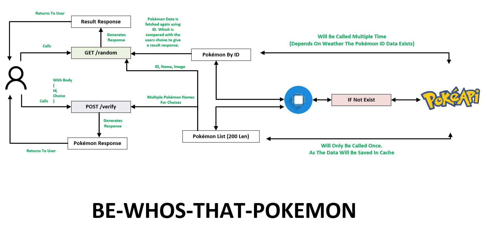

# Introduction

This is the backend of the applciation whos that pokemon. Created by M Faisal Ibrahim.
This backend has two apis which are both connected to the pokeApi provided at tis link: https://pokeapi.co/
The random api gets a random pokemon value and retuns the id, image and a list of choices which includes the pokemons correct answer.
The verify api takes the id and the selected answer from the frontend. It gets the pokemons data using the Id and checks weatehre the name of that pokemon is equal to the name user provided.

# How To Run

1. Clone the repo
2. Install Node 20.15.0
3. Run command npm i
4. run commadn npm run dev
5. This will host the backend on http://localhost:3000.

# Testing

1. To run the test casess, simple run the command npm run test.
2. To generate coverage report, run command npm run test --coverage.
3. Go to coverage/icov-report/index.html. Open this file in your browser to see coverage report.

# Screenshots

- Strucutre
  
